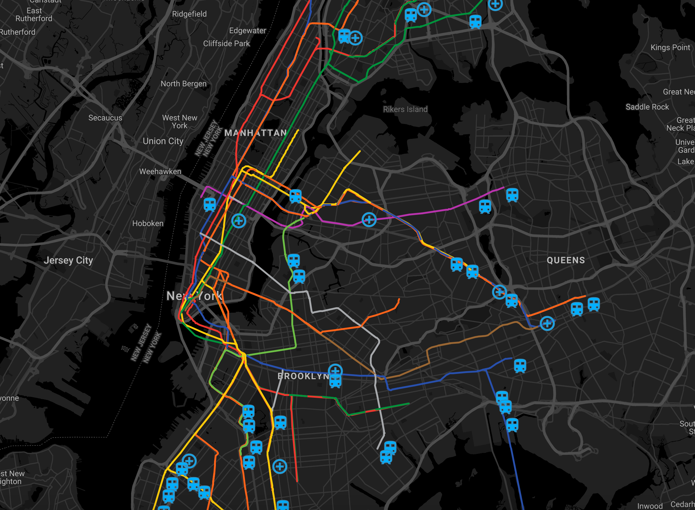
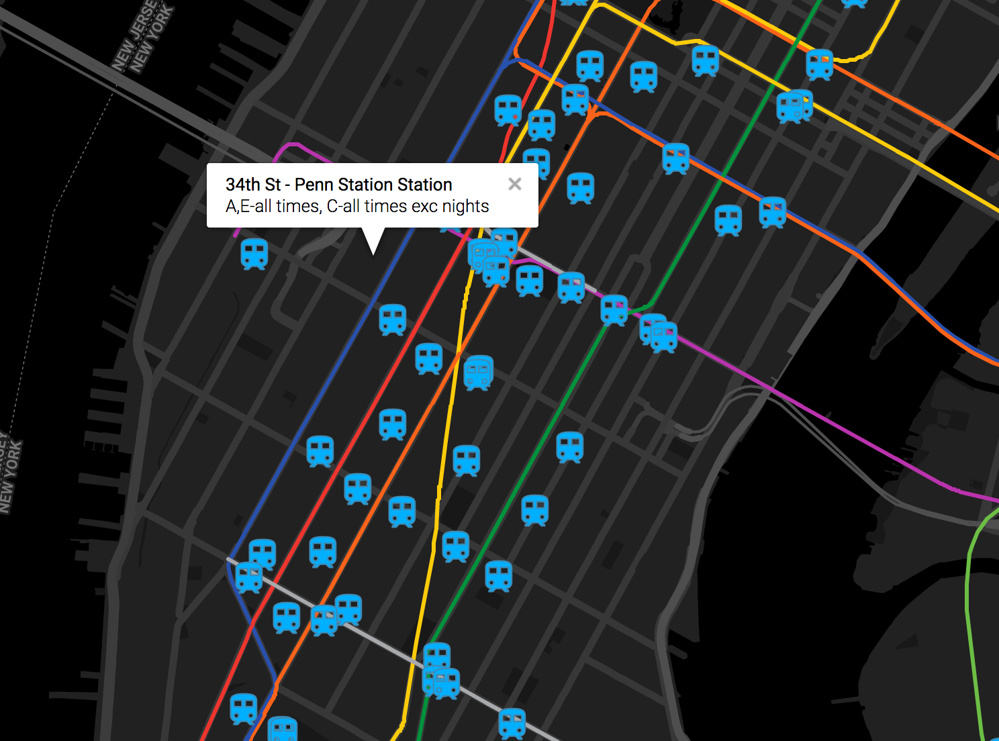

# nyc-subway

NYC subway application for Google Cloud App Engine.





Implemented with [this lab](https://codelabs.developers.google.com/codelabs/nyc-subway-station-locator/)

# Local run

## configure local app engine

```
wget https://storage.googleapis.com/appengine-sdks/featured/go_appengine_sdk_darwin_amd64-1.9.64.zip
unzip go_appengine_sdk_darwin_amd64-1.9.64.zip
rm go_appengine_sdk_darwin_amd64-1.9.64.zip

# fix python env to use python2.7
sed -i "" "s/env python/env python2.7/" go_appengine/dev_appserver.py
export PATH=$PATH:$(pwd)/go_appengine/
```

Install go packages required for the back-end:
```
go get github.com/paulmach/go.geojson
go get github.com/dhconnelly/rtreego
go get github.com/smira/go-point-clustering
```

## run app

```
dev_appserver.py app.yaml
```

## see the results

Navigate to `http://localhost:8080`

## additional

```
$ curl localhost:8080/hello
Hello, world!

$ curl localhost:8080/version
Version: 1.0.0
```